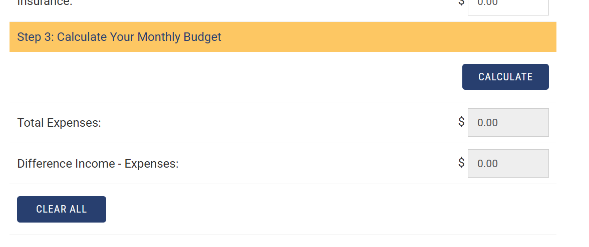

# User Story:

# App Description:
### This app will allow users to save, edit and delete budgets based on their monthly spending amounts that they enter. It will also calculate their total discretionary income. Users will be able to save thier budgets to their account if they intend to track changes or different people's finances.

## Target User:
### People trying to manage their expenses with a detailed record of new and past budgets.

## What Problem it Solves:
### This app provides a budgeting calculator solution for people who want to track their spending in a localized place. It provides users the capability to save their budgets to reference back to them at a later time as well, unlike many popular budget calculators.

# Live App:
[App](https://bud.barrycumbie.com/login.html)

# Value Proposition:
## This app provides a free, simple, convienent and localized way to track spending and discretionary income that can help someone who is looking to start tracking their spending habits but doesnt want to generate thier own budgeting process. 

# Core (40 pts)
* Full-stack app (CRUD + auth + deploy)
* Developer Notebook
* Code Review
* Proposal

# Capability Boxes: (70 pts)
1. Advanced Architecture (10)
Refactor to modern Node structure:
/routes, /controllers, /models, /middleware
Use Mongoose with your own schema design
2. Authentication Upgrade (10)
Login/register system
Sessions or JWT
Protected routes
3. Database Upgrade (10)
Choose ONE:

MongoDB Atlas (cloud DB)
OR local/self-hosted MongoDB on GCP VM
4. UI / UX Design Improvement (10)
Bootstrap-first layout
Clean navigation
Form validation
Better visual hierarchy
5. Deployment Guide / DevOps Write-Up (10)
Step-by-step GCP setup
Nginx + PM2 explanation
Environment variables documented
6. Debug Case Study (10)
Document a real issue:
what broke
why
how you fixed it
7. Search / Tags Feature (10)
Add search OR tagging system
Filter data dynamically

